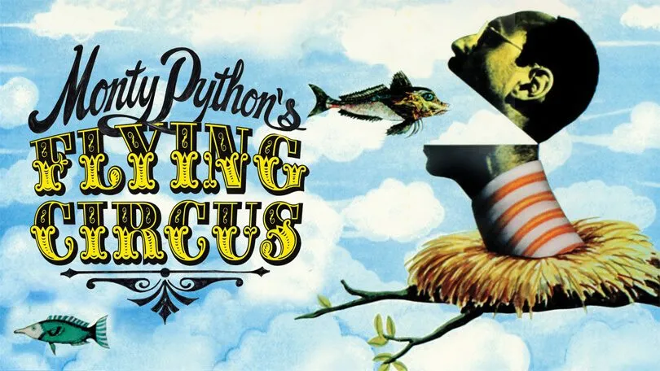
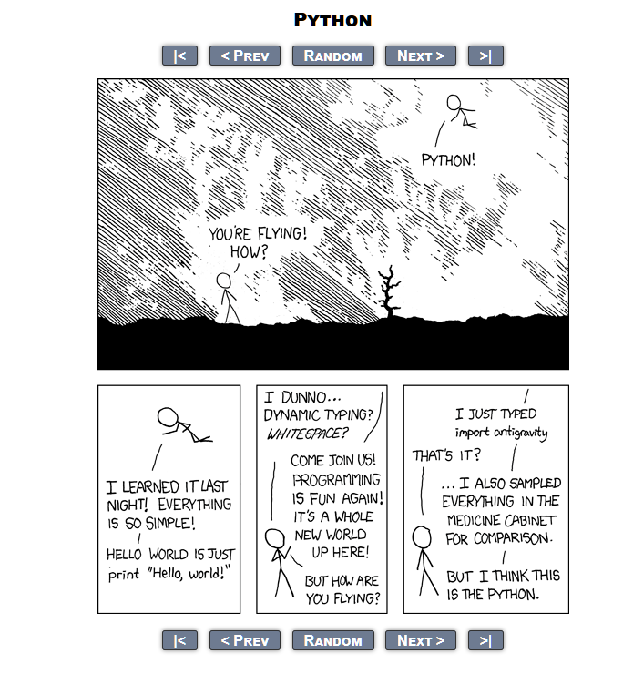

---
jupytext:
  formats: md:myst
  text_representation:
    extension: .md
    format_name: myst
    format_version: 0.13
    jupytext_version: 1.11.5
kernelspec:
  display_name: Python 3
  language: python
  name: python3
---

# Python - and the machine that goes ping

## The life of Python  

- This needs work...

Funny anecdotes from Jack...to be filled later this week or next  

In 1989 [Guido van Rossum]("https://github.com/gvanrossum"), had a bit of spare time and started developping the first implementation of Python to have a way to test scripts quickly and easily on the [Amoeba system]("https://www.cs.vu.nl/pub/amoeba/"). At the time Guido was working at [CWI - Centrum Wiskunde & Informatica]("https://www.cwi.nl/en/"), in Amsterdam, the Netherlands and named it after the [Monty Python Flying Circus]("https://www.rottentomatoes.com/tv/monty_python_s_flying_circus"). Guido is still a core developer to date and was the lead developper until 2018 when he announced that he will go on permanent vacation from his responsibilities as Benevolant Dictator For Life (BDFL). He remained president of the [Python Software Foundation]("https://www.python.org/psf-landing/") until 2023. Since 2023 [Dawn Gibson Wages]("https://dawnwages.info/") is the new president of the foundation.  

  

This brings Python back to the acoustic community, in the [Life of Brian]("https://www.rottentomatoes.com/m/monty_pythons_life_of_brian"), where the [machine that goes PING]("https://www.youtube.com/watch?v=VQPIdZvoV4g") is the favourite machine of the minister...

Python uses IDLE - Integrated Development and Learning Environment, but really named after Eric Idle from Monty Python etc...

Python is currently one of the most popular programming languages, particularly within the machine learning community. Python  

### The Zen of Python and how to fly with Python

- The Zen of Python  

[Tim Peters]("https://en.wikipedia.org/wiki/Tim_Peters_(software_engineer)") is a major contributor to the Python programming language, notably he wrote the original CPYthon implementation.  

A poem called *'The Zen of Python'* by Tim Peters can be accessed in Python through ```import this```  

```text
The Zen of Python, by Tim Peters

Beautiful is better than ugly.
Explicit is better than implicit.
Simple is better than complex.
Complex is better than complicated.
Flat is better than nested.
Sparse is better than dense.
Readability counts.
Special cases aren't special enough to break the rules.
Although practicality beats purity.
Errors should never pass silently.
Unless explicitly silenced.
In the face of ambiguity, refuse the temptation to guess.
There should be one-- and preferably only one --obvious way to do it.
Although that way may not be obvious at first unless you're Dutch.
Now is better than never.
Although never is often better than *right* now.
If the implementation is hard to explain, it's a bad idea.
If the implementation is easy to explain, it may be a good idea.
Namespaces are one honking great idea -- let's do more of those!
```

Note that the Zen of Python has only 19 lines written down but is supposed to have 20. The last one supposedly should be "some bizarre Tim Peters in-joke".  
The poem si a kind of guide to good Python programming habits.  

- Make Python fly  

You can also make Python fly by using the *antigravity* package:  

```python
import antigravity
```

This will open a webpage showing you an [XKCD]("https://xkcd.com/") comic strip about Python:  


