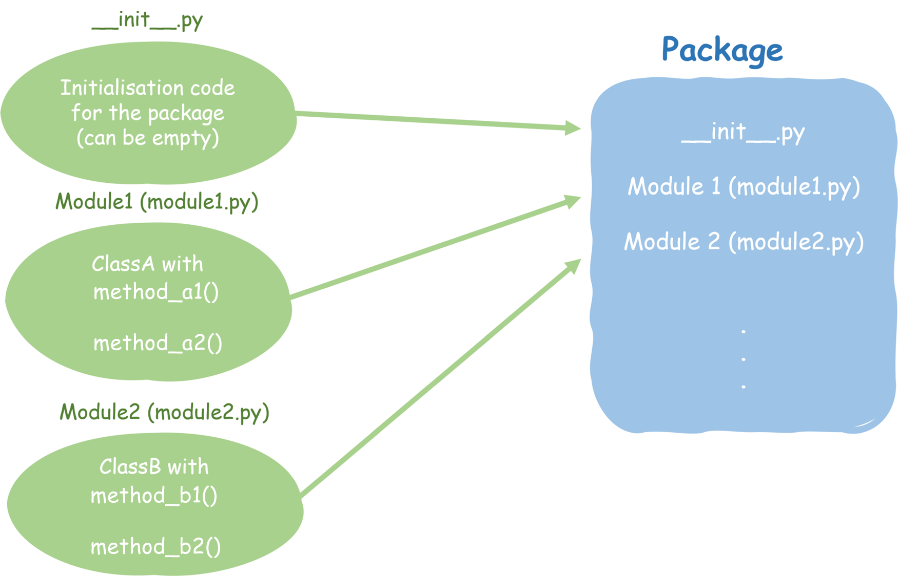

# Python packages  

Python can be described as charged with batteries, to say that it already comes packed with a number of modules (functions and classes) to get you started. Still in every day use of Python, you will need additional external functionality which in Python is commonly imported through packages. Packages are the equivalent to libraries in R and can be compared to toolboxes in Matlab.  

## What is a Python package?  

Typically a Python package contains an initialisation file (__init__.py), and a number of modules (containing classes, functions and variables) stored in a **.py* file.  



### Classes  
Classes can be seen as containers of specific functions and variables. Let's think of a class called *AcousticWave* which we want to use to describe a number of properties of an acoustic wave, like the wave length  

```python
class AcousticWave
```

### Methods Functions  
  
  In Python functions are **def**ined as:  
  
  ```python
  def function_name(v1, v2):
    results = some stuff is happening with the variables
    return results
  ```
  
    Functions are starting with ```def``` followed by the function name with the dependent variables in brackets. This line ends by ```:```.  
    The following lines are indented to deliminate the space specific to the given function. The function end typically with a ```return``` call. ```return```defines the output of the function (what is returned from the function).  

  If functions are tied to a class they are called methods. In our example of the wave length, the function would be *wave_length*, dependent on the soundspeed *c* and the frequency *f*  as *wave_length* $= \frac{c}{f} [m]$

  ```python
  def wave_length(c, f):
    return c / f
  ```
  
  > [!NOTE] Python functions compared to R and Matlab
  >The way functions are written in Python is analoguous to R and Matlab:  
  >
  >__R:__
  >
  >```R
  >function_name = function(v1, v2){
  >    results = some  stuff is happening with the variables
  >    return(results)
  >}
  >```
  >
  >__Matlab:__
  >
  >```matlab
  >function [result] = function_name(v1, v2)
  >     results = some stuff is happening with the variables
  >end
  >```

- Variables  
  Variables can be user defined or defined by initial values. In our examples these would be the sound speed *c* and frequency *f*
  
For example imagine a class AcousticWave which we use to describe acoustic waves. The properties of the acoustic wave depend on variables, that we want the user to provide. These could be *c* the soundspeed in m/s and *f* the frequency in Hz. The properties we want to describe could be wave length defined by a function *wave_length* that depends on *c* and *f*  
  
A very minimalistic example would be:  

```{tip}
*Naming convention for classes , funcitons and variables*  
[Class names](https://peps.python.org/pep-0008/#class-names) should normally use the CapWords naming convention, e.g. AcousticWave  
[Variable and Function names](https://peps.python.org/pep-0008/#function-and-variable-names) should generally by lowercase, with words separated by underscores, e.g. wave_length
```

A Python package contains one or more modules. A module is a *.py* file that contains reusable code, typically functions or models

## Comparison using additional tools in Python, R, Matlab  

| Python | R |
| ------ | - |
| import packages | load libraries |
| ```import packagename``` or with an alias ```import packagename as pkg```, to import specific functions from a package we can use ```from packagename import function```    |```library(packagename)``` <br> In R libraries need to be loaded to allow usage of specialised functions. Typically in R you import entire libraries, but since R 4.0 you can also import specific functions through ```library(packagename, include.only=c("function1", function2"))``` similarly, to avoid conflicts between different libraries funcitons can be exluded through ```library(packagename, exclude= c("function3", "function4"))```|
|__Specific examples:__||  
|```import numpy as np``` <br>This imports the numpy package and all numpy functions can be called through the alias ```np``` using ```np.function()``` <br><br> ```import echopype as ep``` this imports the echopype package awith the alias ```ep``` <br> ```from echopype import open_raw``` this imports only the ```open_raw()```function from ```echopype```|<br> <br> ```library(ggplot2)``` this imports one of the most popular graphics libraries in R. Functions from the library can be used by just calling the function (for example ```ggplot()``` or by specifying the package and the function ```ggplot2::ggplot()``` <br><br> ```library(dplyr, include.only=c("filter", "select"))``` imports only the ```filter``` and ```select```functions from the ```dplyr```package. ```library(dplyr, exclude=c("mutate", "lag"))```imports all functions from the```dplyr```package except for the```mutate```and```lag``` functions|